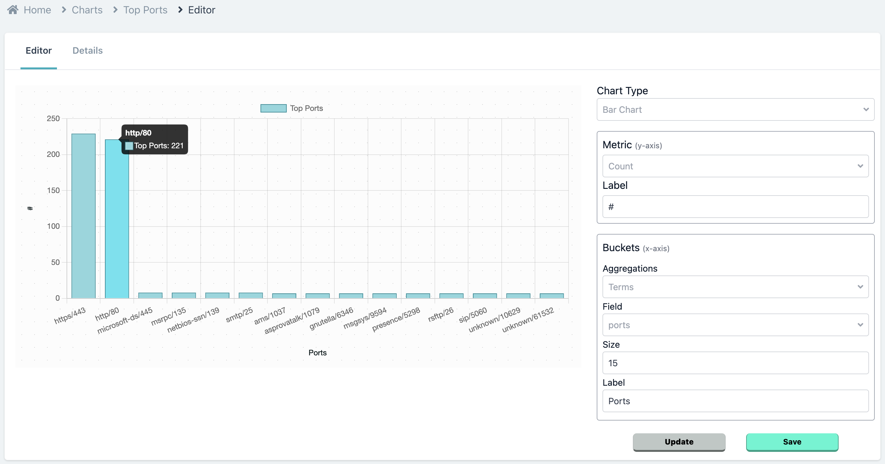
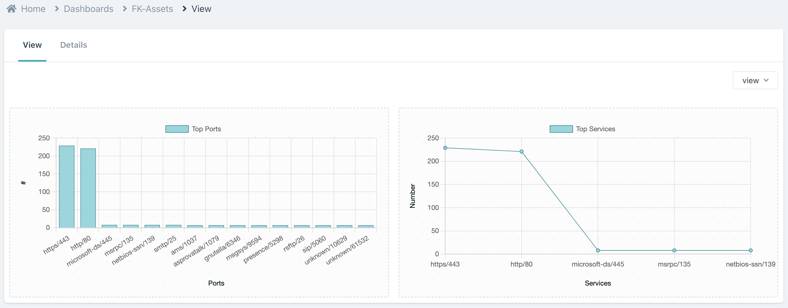

# Visualizations

To visualize the data stored in your [Objects](/docs/Core%20Concepts/Objects), Users can use **Charts**.

### Charts

Totally customizable charts can be created on the data points that users store in their Objects.

### Dashboards

Some charts are always relevant to be looked at together, Dashboards let you create a central panel for a **Group of your Charts**.

