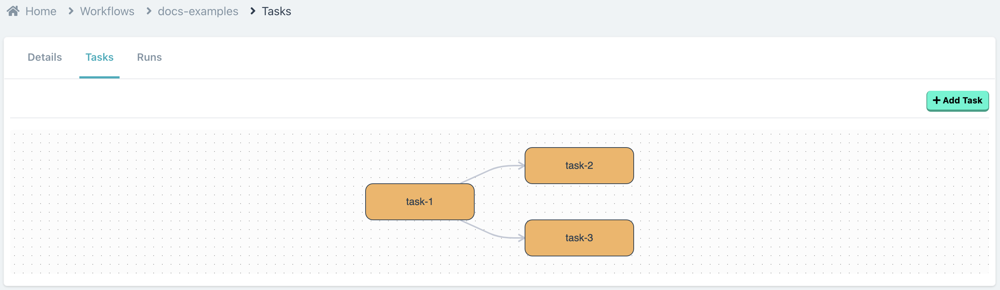
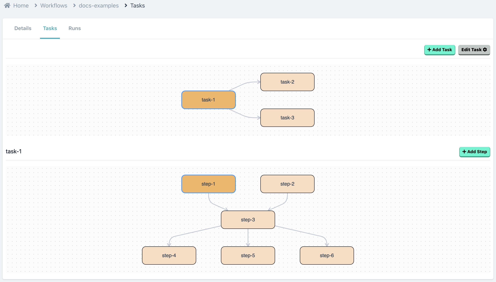

# Workflows

A workflow is the entity which let's you define your automataions in modular **tasks**.

### Task

A workflow is made up of a Tree [**(DAG)**](https://en.wikipedia.org/wiki/Directed_acyclic_graph) of tasks.

 

Task is way of making your workflows modular, so that they are manageable and clean.

Every task in itself is Tree of **Steps**.

### Step

A Step is a core unit of your automation, which will contain your **Code** for automation, it's **Inputs** and the **Outputs**.

